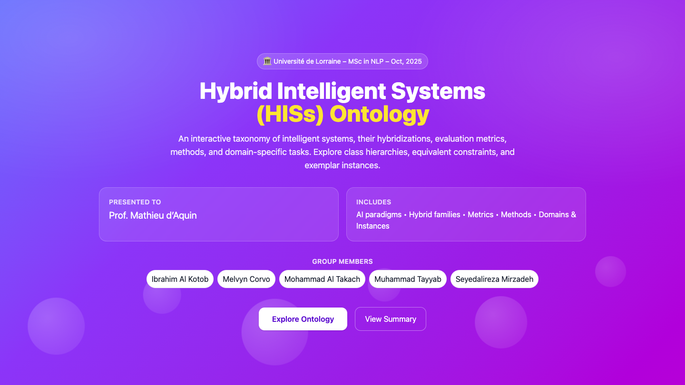
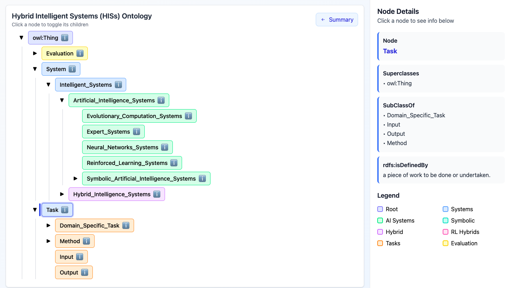

# Hybrid Intelligent Systems (HISs) Ontology

[](https://www.univ-lorraine.fr/)
[](https://tayyab.io)
[](https://tayyab.io/ontology/)
[](https://github.com)

> **MSc in Natural Language Processing** - October 2025  
> Université de Lorraine



An interactive, hierarchical taxonomy of **Hybrid Intelligent Systems**, their underlying AI paradigms, evaluation metrics, application methods, and domain-specific tasks with real-world instances.

🔗 **[Explore Live Interactive Demo →](https://tayyab.io/ontology/)**

---

## 🎯 Project Overview

### What is This Ontology?

The **Hybrid Intelligent Systems Ontology** is a formal knowledge representation that structures and organizes:

- **Pure AI Paradigms**: Neural Networks, Symbolic AI, Evolutionary Computation, Reinforcement Learning, Expert Systems
- **Hybrid AI Approaches**: Neuro-symbolic, Neuro-fuzzy, Genetic Fuzzy Systems, and 9+ hybrid families
- **Evaluation Metrics**: Accuracy, F1-Score, AUC-ROC, Mean Average Precision, and more
- **Application Domains**: Healthcare, Agriculture, Manufacturing, Security, Law, Business, and others
- **Methods**: Analysis, Automated Reasoning, Knowledge Representation, Semantic Similarity

### Why This Matters

Hybrid Intelligent Systems combine multiple AI paradigms to leverage their complementary strengths. This ontology provides:

✅ **Structured Classification** - Formal hierarchy of AI systems and their relationships  
✅ **Semantic Relationships** - Object properties like `RelyOn`, `isDesignedToSolve`, `ObtainedUsing`  
✅ **Real-World Instances** - 9 concrete examples mapping hybrid systems to domains  
✅ **Interactive Exploration** - Visual tree navigation with detailed node information

---

## 📊 Ontology Statistics

| Component | Count | Examples |
|-----------|-------|----------|
| **Pure AI Paradigms** | 5 | Neural Networks, Symbolic AI, Expert Systems, Evolutionary Computation, RL |
| **Hybrid Systems** | 13 | Neuro-symbolic, Neuro-fuzzy, Genetic Fuzzy, Evolutionary NN, RL Hybrids |
| **Evaluation Metrics** | 5 | Accuracy, F1-Score, AUC-ROC, MAE, MAP |
| **Application Domains** | 9 | Healthcare, Agriculture, Manufacturing, Security, Law, Business, etc. |
| **Methods** | 6 | Analysis, Automated Reasoning, Knowledge Representation, Modelling |
| **Real-World Instances** | 9 | Medical Diagnosis, Smart Home Energy, Legal Document Assistant, etc. |

---

## 🏗️ Ontology Structure

### Core Class Hierarchy



```
owl:Thing
├── Evaluation
│   ├── AI_Model_Evaluation
│   │   └── Evaluation_Metrics
│   │       ├── Accuracy
│   │       ├── AUC_ROC
│   │       ├── F1_Score
│   │       ├── Mean_Absolute_Error
│   │       └── Mean_Average_Precision
│   └── Benchmark
│       └── AI_Benchmarks
│
├── System
│   └── Intelligent_Systems
│       ├── Artificial_Intelligence_Systems
│       │   ├── Evolutionary_Computation_Systems
│       │   ├── Expert_Systems
│       │   ├── Neural_Networks_Systems
│       │   ├── Reinforced_Learning_Systems
│       │   └── Symbolic_Artificial_Intelligence_Systems
│       │       ├── Fuzzy_Logic_Systems
│       │       └── Rough_Set_Systems
│       │
│       └── Hybrid_Intelligence_Systems
│           ├── Neuro-symbolic_Systems
│           ├── Neuro-fuzzy_Systems
│           ├── Connectionist_Expert_Systems
│           ├── Evolutionary_Neural_Networks
│           ├── Genetic_Fuzzy_Systems
│           ├── Fuzzy_Expert_Systems
│           ├── Hybrid_Connectionist_Symbolic_Models
│           ├── Rough_Fuzzy_Hybridization
│           └── Reinforcement_Learning_Hybrids
│               ├── Evolutionary_Reinforcement_Learning
│               ├── Fuzzy_Reinforcement_Learning
│               ├── Neural_Reinforcement_Learning
│               └── Symbolic_Reinforcement_Learning
│
└── Task
    ├── Domain_Specific_Task
    │   ├── Agriculture
    │   ├── Business
    │   ├── Health_Care
    │   ├── Law
    │   ├── Management
    │   ├── Manufacturing
    │   ├── Security
    │   ├── Smart_System
    │   └── Software_Development
    ├── Method
    │   ├── Analysis
    │   ├── Automated_Reasoning
    │   ├── Information_Standardization
    │   ├── Knowledge_Representation
    │   ├── Modelling
    │   └── Semantic_Similarity
    ├── Input
    └── Output
```

---

## 🔗 Object Properties

### Key Relationships

| Property | Domain | Range | Description |
|----------|--------|-------|-------------|
| **isDesignedToSolve** | Intelligent_Systems | Domain_Specific_Task | Links systems to tasks they address |
| **RelyOn** | Hybrid_Intelligence_Systems | Artificial_Intelligence_Systems | Specifies which AI paradigms a hybrid combines |
| **ObtainedUsing** | Domain_Specific_Task | Hybrid_Intelligence_Systems | Maps task solutions to hybrid approaches |

### Example: Neuro-symbolic Systems

```owl
Neuro-symbolic_Systems
  ⊑ Hybrid_Intelligence_Systems
  ⊑ (RelyOn SOME Neural_Networks_Systems)
  ⊑ (RelyOn SOME Symbolic_Artificial_Intelligence_Systems)
```

**Definition**: Integrates neural networks for efficient learning with symbolic AI for compositional reasoning and interpretability.

---

## 💡 Real-World Instances

### 9 Concrete Application Examples

| Instance | Domain | Hybrid System Used | Description |
|----------|--------|-------------------|-------------|
| **Medical Diagnosis Support System** | Health_Care | Neuro-symbolic | Analyzes medical records, images, and lab results with interpretable recommendations |
| **Precision Irrigation Decision Support** | Agriculture | Genetic Fuzzy Systems | Optimizes irrigation schedules using genetic algorithms and fuzzy rules |
| **Smart Home Energy Optimization** | Smart_System | Fuzzy RL | Optimizes energy consumption through fuzzy sensor interpretation and RL |
| **Intrusion Detection & Response** | Security | Neural RL | Detects network anomalies and adapts security policies |
| **Legal Document Reasoning Assistant** | Law | Symbolic RL | Interprets legal documents with logic-based inference and adaptive retrieval |
| **Predictive Maintenance System** | Manufacturing | Evolutionary NN | Predicts equipment failures and optimizes workflows |
| **Customer Sentiment Analysis Tool** | Business | Neuro-symbolic | Analyzes feedback with neural text processing and symbolic business reasoning |
| **Automated Bug Detection System** | Software_Development | Neuro-symbolic | Identifies bugs with neural code analysis and symbolic syntax reasoning |
| **Adaptive Project Management Support** | Management | Rough Fuzzy | Models uncertain project factors with rough sets and fuzzy logic |

---

## 🎨 Key Features

### Interactive Visualization

- **Collapsible Tree Navigation** - Explore the hierarchy interactively
- **Color-Coded Categories** - Visual distinction between system types
- **Node Details Panel** - View definitions, superclasses, subclasses, and relationships
- **Summary Dashboard** - Quick statistics and overview

### Semantic Richness

- **Formal Definitions** - Every class has `rdfs:isDefinedBy` annotations
- **Equivalent Classes** - OWL restrictions define hybrid systems formally
- **Instance Examples** - Real-world applications with detailed descriptions

### Professional Design

- **Responsive Layout** - Works on desktop, tablet, and mobile
- **Loading Animation** - 4-second professional boot sequence
- **Welcome Screen** - Full-viewport hero with project context
- **Modal Summary** - Comprehensive statistics and overview

---

## 🎓 Academic Context

### Course Information

- **Institution**: Université de Lorraine
- **Program**: MSc in Natural Language Processing (NLP)
- **Course**: Knowledge Representation and Semantic Web
- **Instructor**: Prof. Mathieu d'Aquin
- **Date**: October 2025


## 📚 Theoretical Foundations

### Hybrid Intelligent Systems

Hybrid Intelligent Systems combine multiple AI paradigms to overcome limitations of individual approaches:

1. **Neural Networks** - Efficient learning from data, pattern recognition
2. **Symbolic AI** - Explicit reasoning, interpretability, compositionality
3. **Fuzzy Logic** - Handling uncertainty and imprecision
4. **Evolutionary Computation** - Optimization and adaptation
5. **Reinforcement Learning** - Sequential decision-making

### Example Hybridizations

**Neuro-symbolic Systems**: Combine neural learning with symbolic reasoning
- **Strengths**: Interpretable, data-efficient, compositional
- **Applications**: Medical diagnosis, legal reasoning, software debugging

**Neuro-fuzzy Systems**: Integrate fuzzy logic with neural learning
- **Strengths**: Human-like reasoning, handles uncertainty, adaptive
- **Applications**: Control systems, decision support, forecasting

**Genetic Fuzzy Systems**: Use genetic algorithms to evolve fuzzy rules
- **Strengths**: Automated rule discovery, parameter optimization
- **Applications**: Agriculture, robotics, process optimization

---

## 🔬 Research Applications

### Use Cases for This Ontology

1. **AI System Design** - Reference architecture for building hybrid systems
2. **Literature Review** - Structured taxonomy for surveying hybrid AI research
3. **Educational Tool** - Teaching resource for AI courses
4. **Semantic Search** - Enable intelligent search over AI systems and methods
5. **System Recommendation** - Match domain problems to appropriate hybrid approaches

### Potential Extensions

- [ ] Add more granular subclasses for each hybrid family
- [ ] Include temporal properties for system evolution
- [ ] Link to external knowledge bases (DBpedia, Wikidata)
- [ ] Integrate performance benchmarks for each system type
- [ ] Add datatype properties for quantitative metrics

---

## 🛠️ Technical Implementation

### Technologies Used

- **HTML5 + CSS3** - Structure and styling
- **Vanilla JavaScript** - Interactive tree navigation
- **Tailwind CSS** - Utility-first styling framework
- **OWL Concepts** - Formal ontology modeling (conceptual)

### Features Implemented

✅ Hierarchical tree with expand/collapse  
✅ Node selection with detail view  
✅ Color-coded categories  
✅ Responsive design (mobile-friendly)  
✅ Loading animation with progress bar  
✅ Welcome screen with floating bubbles  
✅ Modal summary with statistics  
✅ Keyboard navigation (Escape to close)

---

## 📖 How to Use

### Exploring the Ontology

1. **Visit the Live Demo**: [https://tayyab.io/ontology/](https://tayyab.io/ontology/)
2. **Click "Explore Ontology"** on the welcome screen
3. **Navigate the tree**: Click nodes to expand/collapse
4. **View details**: Click any node to see definitions in the right panel
5. **Check summary**: Click "Summary" button for statistics

### Understanding Node Colors

- 🟪 **Indigo**: Root (owl:Thing)
- 🔵 **Blue**: System classes
- 🟢 **Green**: AI Systems
- 🔷 **Teal**: Symbolic AI variants
- 🟣 **Purple**: Hybrid Systems
- 🩷 **Pink**: RL Hybrids
- 🟠 **Orange**: Tasks and domains
- 🟡 **Yellow**: Evaluation metrics

---

## 📄 Copyright & Usage

© 2025 Ibrahim Al Kotob, Melvyn Corvo, Mohammad Al Takach, Muhammad Tayyab, Seyedalireza Mirzadeh. All rights reserved.

This is an academic project for educational purposes. The ontology structure and interactive visualization are available for reference and learning, but not for commercial use without permission.

---

## 🙏 Acknowledgements

- **Prof. Mathieu d'Aquin** - Course instruction and guidance
- **Université de Lorraine** - Academic support and resources
- **MSc NLP Program** - Collaborative learning environment

---


---

## 🔮 Future Enhancements

### Planned Improvements

- [ ] **SPARQL Endpoint** - Query interface for semantic search
- [ ] **Export Functionality** - Download as OWL/RDF, JSON-LD
- [ ] **Visual Graph View** - Network diagram of relationships
- [ ] **Search & Filter** - Find nodes by keyword
- [ ] **Comparison Mode** - Side-by-side hybrid system comparison
- [ ] **Mobile App** - Native iOS/Android ontology browser
- [ ] **API Integration** - REST API for programmatic access
- [ ] **Multi-language Support** - French, Arabic, English labels

### Research Directions

- Formal verification of equivalence axioms
- Integration with upper ontologies (SUMO, DOLCE)
- Performance benchmarking dataset alignment
- Crowd-sourced instance contribution platform

---

**Last Updated**: October 2025  
**Version**: 1.0  
**Status**: Academic Project - Interactive Demo Live

---

*An educational resource exploring the landscape of Hybrid Intelligent Systems through formal knowledge representation and interactive visualization.*
